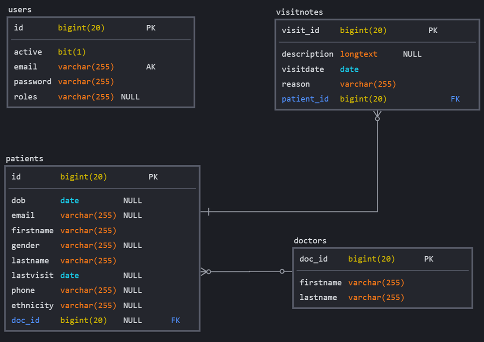
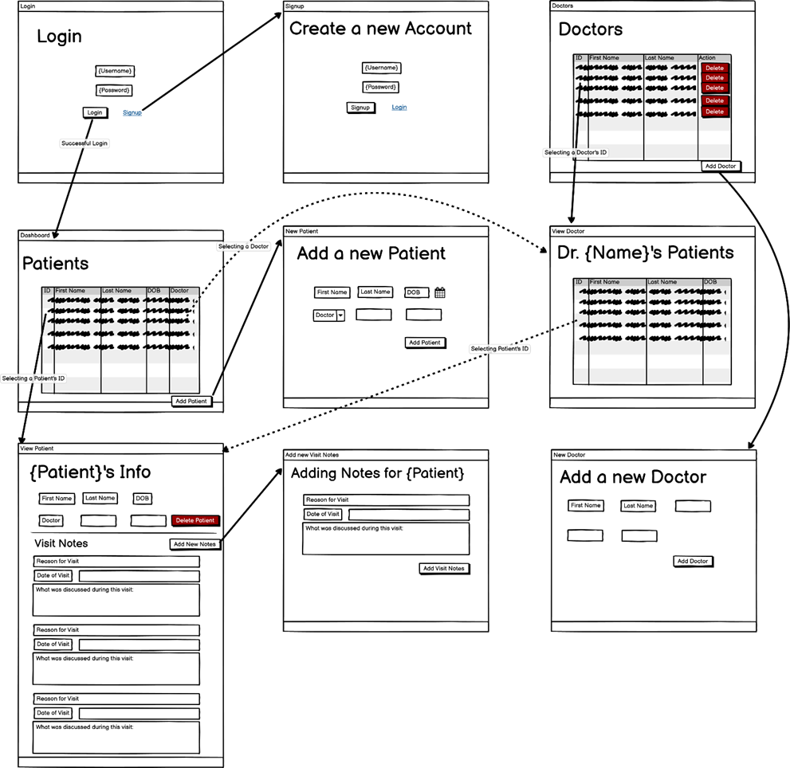

# Patient Portal Application
This project is a web application management system for healthcare patients and doctors. Users are able to view all the patients and doctors currently in the system as well as add additional ones as needed. All of these entities are stored in a database and are retrieved when needed to display on a webpage.

Tables are used to view all the entities at once with certain attributes about them (e.g. name, unique ID number, date of birth, etc.). Patient information can be modified by navigating to their individual page using a hyperlink in their table row.

https://patientportalapp.herokuapp.com/

---
### Functional Requirements

1. User Authentication and Authorization
   * Users must have an account to log into the application
   * The provided credentials must match what is stored in the database
   * Users may sign up for an account
   * Access is restricted to the login and registration pages without proper authorization
   * Users may logout of the application to end their session
2. Database
   * All entities are stored in a database using MariaDB
   * Visit notes and doctors each have a mapped relationship with the patients
   * Users' passwords are stored as encrypted strings
3. Front-end
    * Views are generated using Thymeleaf fields with data passed from the back-end controller
    * Forms can be submitted to add new entities to the database
4. Spring Framework
    * Spring handles the communications between the different layers in the application
    * Spring provides the Views with data from the repositories to populate the pages
    * Spring Security controls the authorization of users
5. Unit Testing
    * Each repository method is tested for accuracy
    * Multiple service-layer methods are tested to ensure correct functionality
    * All custom queries have associated tests
---
### Technical Specifications
1.	Spring Boot
2.	Spring Security
3.	Spring Data JPA
4.	Spring Boot Devtools
5.	Spring Boot Validation
6.	Thymeleaf
7.	MariaDB
8.	JUnit
9.	JQuery
10.	HTML/CSS/Bootstrap
---
### Challenges Faced During Development
1.	Spring Security – learning how to use and implement its security features
2.	Date objects – figuring out how to accurately pass Dates between all the application layers
3.	Relationship Mapping – setting up relationships between Entities, managing the mapping when removing an Entity, and querying for their values/attributes
---
### Future Implementations
1. Roles – authorize access to different parts of the application based on the assigned role
    *	Example: allowing patients log in and view their own information
2. Scheduling – feature to make appointments and view them on a patient’s page
3. Prescriptions – feature to assign prescriptions and modify the list as needed
4. Auto-login – logs in the user after registering for their new account
5. Design:
    * Custom confirmation dialog boxes when deleting an object
    * Autoformatting fields (e.g. entering a phone number)
---
### Entity Relationship Diagram

---
### Wireframe

---
### User Stories
1.	As a User, I want to log into the website with correct credentials so that I may access the website.
2.	As a User, I want to register as a new user so that I may log into the website.
3.	As a User, I want to view a list of all Patients.
4.	As a User, I want to add new Patients so that they are included in the list of all Patients.
5.	As a User, I want to view an individual Patient’s information.
6.	As a User, I only want to be able to edit an individual Patient’s information after selecting a toggle.
7.	As a User, I want to edit an individual Patient’s information so that it is updated in the system.
8.	As a User, I want to view an individual Patient’s Visit Notes over time.
9.	As a User, I want to add new Visit Notes to an individual Patient.
10.	As a User, I want to add a long Description when adding new Visit Notes.
11.	As a User, I want to delete an individual Patient so that they are no longer in the list of all Patients.
12.	As a User, I want to delete an individual Patient’s Visit Notes so that they are no longer in the system.
13.	As a User, I want all Visit Notes attached to a Patient to be deleted along with the Patient so that the Visit Notes do not exist without a Patient.
14.	As a User, I want to view a list of all Doctors.
15.	As a User, I want to view a list of all Patients assigned to an individual Doctor.
16.	As a User, I want to add new Doctors so that they are included in the list of all Doctors.
17.	As a User, I want to delete an individual Doctor so that they are no longer in the list of all Doctors.
18.	As a User, I want to log out of the website when I am finished so that my account is no longer in use.
19.	As a User, I want to view an error message when inputting incorrect data into fields.

